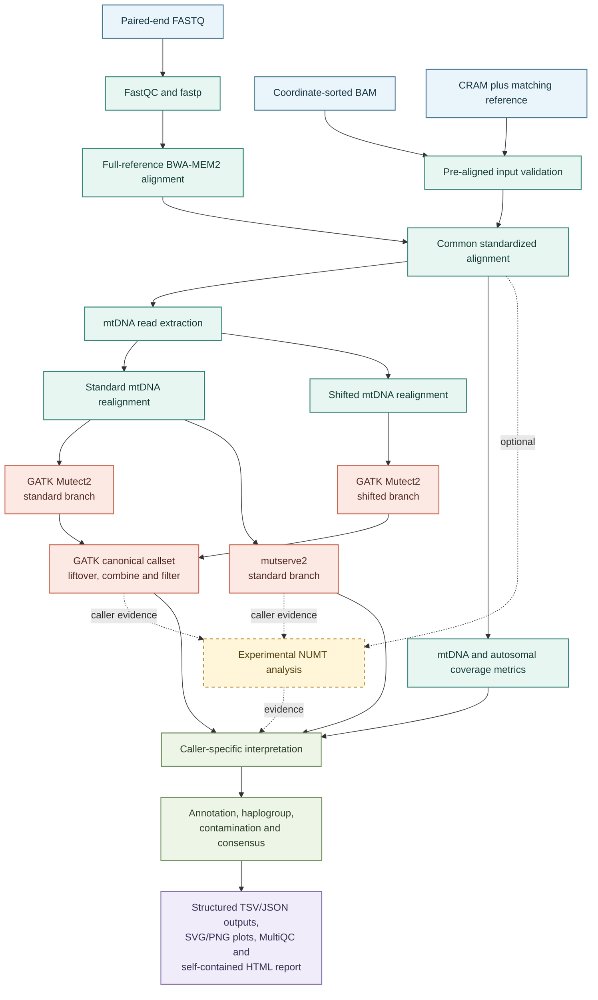
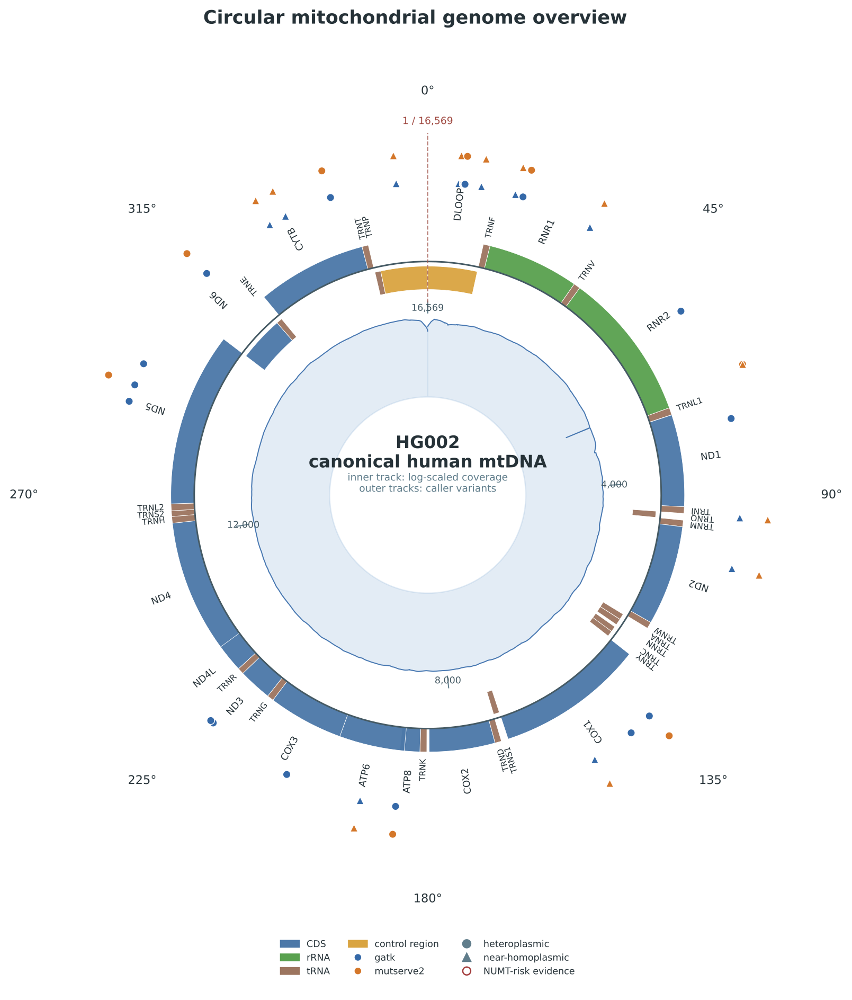
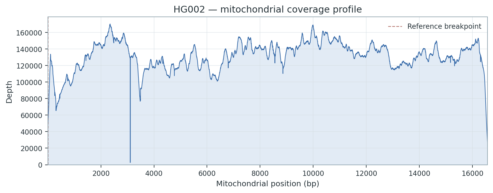
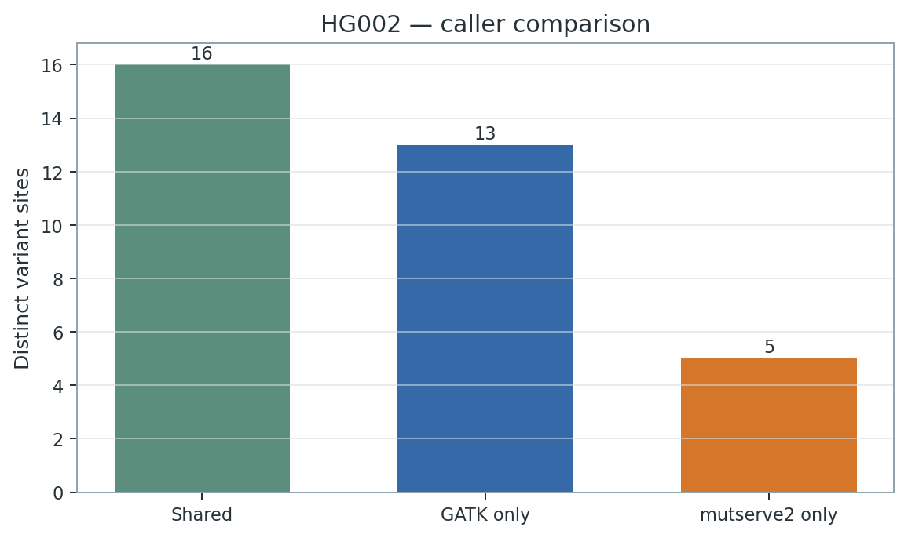

# MitoArc

[](https://github.com/sarvezh1/mitoarc/releases/tag/v1.0.0)
[](https://doi.org/10.5281/zenodo.23154158)

**A reproducible short-read workflow for human mitochondrial genome analysis.**

MitoArc v1.0.0 is a Nextflow workflow for paired-end FASTQ, coordinate-sorted BAM, and CRAM inputs. It keeps caller-specific evidence separate while producing auditable mitochondrial QC, variants, interpretation, consensus sequences, plots, MultiQC output, and a self-contained HTML report.

Licensed under the [MIT License](LICENSE).

<br clear="right">

## Paper data

Machine-readable values underlying selected benchmark results reported in the MitoArc manuscript and Supplementary Information are available in [`paper_data/`](paper_data/). The package contains software versions, caller depth metrics, NUMT observability, NUMT Strategy A/B metrics, matched circular-coordinate metrics, and complete-workflow resource measurements.

Overall caller false positives use `TOTAL_EXACT_TRUTH_FP`. NUMT Strategy A/B false positives use `OBSERVABLE_NUMT_ASSOCIATED_FP`. VAF error is based on achieved VAF among recovered truth alleles. The three benchmark replicates are technical stochastic replicates, not biological replicates. Strategy C is an evidence-classification view rather than an independent caller; its v1.0.0 fragment-level allele-support scope is SNV-focused, and non-SNV records may receive `UNRESOLVED_SUPPORT`. The evaluated mutserve2 configuration did not enable beta insertion or deletion modes.

## Overview

MitoArc provides:

- read QC and full-reference alignment for paired-end FASTQ;
- validated entry paths for pre-aligned BAM and CRAM;
- mtDNA extraction, depth metrics, and standard plus shifted-coordinate processing;
- GATK mitochondrial Mutect2 and an independent mutserve2 comparison;
- an experimental NUMT evidence framework with baseline, mapping-confidence, and evidence-classification views;
- HaploGrep haplogroup assignment and Haplocheck contamination assessment;
- functional annotation and caller-specific consensus sequences;
- structured TSV, JSON, VCF, BAM, FASTA, and provenance outputs; and
- MultiQC, reproducible SVG/PNG plots, and a portable self-contained HTML report.

These are implemented workflow capabilities; MitoArc does not claim that every component is novel or that its outputs are clinically validated.

## Workflow



FASTQ inputs undergo full human-reference alignment. BAM and CRAM inputs enter through validation and normalization, then share the same mtDNA downstream analysis. NUMT evidence is experimental and depends on retained nuclear alignment context.

## Requirements

- Nextflow `>=23.04.0` (v1.0.0 was validated with Nextflow 26.04.6)
- Docker with access to the pinned container images
- a human reference FASTA containing the mitochondrial contig and the same contig/reference representation used by any pre-aligned input
- storage and CPU appropriate to read count and requested depth

Resource demand depends strongly on input scale and alignment mode. Full GRCh38 FASTQ alignment and BWA-MEM2 indexing require substantially more memory than the reduced pre-aligned validation performed on the development laptop. The default lightweight process resources are not a statement that 8 GB RAM is sufficient for full-human FASTQ processing; use a suitably provisioned host and site-specific Nextflow resource configuration.

## Quick start

Prepare one samplesheet, then run from the repository root:

```bash
# Paired-end FASTQ
nextflow run . -profile docker \
  --input samplesheet_fastq.csv \
  --reference references/GRCh38.fa \
  --outdir results

# Coordinate-sorted BAM
nextflow run . -profile docker \
  --input samplesheet_bam.csv \
  --reference references/GRCh38.fa \
  --outdir results

# CRAM (the supplied FASTA must match the CRAM reference)
nextflow run . -profile docker \
  --input samplesheet_cram.csv \
  --reference references/GRCh38.fa \
  --outdir results
```

Add `--numt_strategy comparison` to emit the experimental Strategy A/B/C comparison when the input retains evaluable nuclear context. See [pre-aligned input requirements](docs/prealigned_inputs.md) for BAM/CRAM validation details.

## Input

Exactly one schema is accepted per run. Paths may be relative to the samplesheet or portable project paths.

FASTQ:

```csv
sample,fastq_1,fastq_2
SAMPLE_01,reads/SAMPLE_01_R1.fastq.gz,reads/SAMPLE_01_R2.fastq.gz
```

BAM:

```csv
sample,bam
SAMPLE_01,alignments/SAMPLE_01.sorted.bam
```

CRAM:

```csv
sample,cram
SAMPLE_01,alignments/SAMPLE_01.cram
```

FASTQ analysis requires a full human alignment reference suitable for BWA-MEM2. BAM/CRAM must be coordinate sorted, contain the requested mitochondrial contig (default `chrM`), and match the supplied FASTA. CRAM decoding specifically requires the reference used to create the CRAM. Existing indexes are used when supplied; required temporary indexes are created in the Nextflow work directory without modifying source inputs.

## Outputs

| Directory | Key outputs |
| --- | --- |
| `qc/` | input validation, FastQC/fastp, alignment statistics, mtDNA and autosomal-context metrics |
| `alignment/` | full-reference FASTQ alignment products |
| `mtDNA/` | extracted and standard/shifted realigned mtDNA BAMs |
| `variants/gatk/` | canonical GATK raw and filtered VCFs |
| `variants/mutserve2/` | native and normalized mutserve2 VCF/call tables |
| `variants/comparison/` | caller-preserving shared and caller-only summaries |
| `variants/numt/` | experimental mapping/evidence tables when enabled |
| `interpretation/` | haplogroup, contamination, annotation, and caller-specific consensus outputs |
| `plots/` | deterministic SVG and PNG figures |
| `report/` | reporting summary TSV/JSON, MultiQC, plot source tables, and `<sample>.mtDNA_report.html` |

VCFs and source TSVs remain authoritative; the HTML report is a downstream presentation layer.

## Experimental NUMT framework

- **Strategy A** is native/baseline caller behavior without mapping-confidence filtering.
- **Strategy B** filters fragments using full-reference mapping context before repeating the caller paths. It trades sensitivity for removal of observable synthetic NUMT-associated signals in the controlled benchmark.
- **Strategy C** classifies allele-support evidence; it is an evidence framework, not a recommended callset and not a general performance claim.

The current Strategy C fragment-level allele-support implementation is **SNV-scoped**. Indels and other non-SNV alleles can be returned as `UNRESOLVED_SUPPORT` rather than classified. Strategy C is not presented as recommended.

## Circular handling

MitoArc implements both standard and shifted mitochondrial coordinate processing, then lifts shifted calls back to canonical coordinates. In matched controlled benchmark testing, standard-only and standard-plus-shifted callsets had a null boundary-specific delta under the tested fixture. This result does not demonstrate an incremental boundary-sensitivity benefit, nor does it establish absence of benefit in other sequence contexts or read designs.

## mutserve2 configuration

The evaluated and default frozen v1.0.0 configuration uses mutserve2 2.0.3 without enabling its beta insertion or deletion options. Benchmark indel results are therefore configuration-scoped; they do not imply that mutserve2 cannot call indels in other configurations.

## Validation

### Real-human HG002 validation

End-to-end BAM validation used genuine GIAB HG002 data: complete chrM plus reduced, partial nuclear context. The run produced complete reporting, mean mtDNA depth of approximately 131,324×, and H5a7 assignments from both callers.

This was **not complete-WGS nuclear context and not full-human FASTQ validation**. Consequently, contamination was `INSUFFICIENT_DATA`, and the mtDNA copy-number proxy was unavailable because mapped autosomal context was incomplete.

### Controlled benchmark

The controlled benchmark used three stochastic replicates, six depths (100, 250, 500, 1000, 2000, and 5000×), 36 truth alleles per generated input, 648 input truth observations, and exact normalized truth matching.

For the NUMT comparison, FP values use `OBSERVABLE_NUMT_ASSOCIATED_FP`:

| Configuration | TP | FP | FN | Recall |
| --- | ---: | ---: | ---: | ---: |
| GATK Strategy A | 193 | 33 | 23 | 0.894 |
| GATK Strategy B | 172 | 0 | 44 | 0.796 |

For the caller comparison, FP values use `TOTAL_EXACT_TRUTH_FP`:

| Caller, Strategy A | TP | FP | FN |
| --- | ---: | ---: | ---: |
| GATK | 548 | 33 | 100 |
| mutserve2 | 311 | 17 | 337 |

GATK recall rose from 0.741 at 100× to 0.917 at 5000×; no optimal depth was established. Matched circular testing found no boundary-specific recovery delta. Caller disagreement without truth is descriptive and is not itself classified as error. Compact frozen evidence and scopes are documented in [validation summary](docs/validation/README.md).

## Real HG002 showcase

The following figures are lightweight copies from the frozen real-HG002 validation outputs; no HG002 BAM, VCF, or reference is included.



| Mitochondrial depth profile | Caller comparison |
| --- | --- |
|  |  |

[Legacy HG002 example report](assets/validation/hg002/HG002.mitoarc_report.html) · [VAF landscape](assets/validation/hg002/HG002.vaf_landscape.png) · [Consequence summary](assets/validation/hg002/HG002.variant_consequences.png)

This example used complete chrM with reduced, partial nuclear context; it is not complete-WGS nuclear-context or full-human FASTQ validation.

The legacy report retains pre-release metadata; the final interpretation of the reduced HG002 input is `PARTIAL_NUCLEAR_CONTEXT`.

## Reproducibility

Tool and container versions are pinned in workflow modules and container definitions. The controlled benchmark uses deterministic seeds recorded by replicate. Nextflow `-resume` can reuse matching cached processes; preserve the work directory when resuming and treat published structured TSV/JSON/VCF outputs as the audit trail. Plot generation consumes structured source tables and does not alter calls.

## Known limitations

- Real HG002 validation used reduced nuclear context; complete-WGS nuclear-context and full-human FASTQ validation remain desirable.
- Synthetic NUMT fixtures are controlled technical challenges and do not capture full biological NUMT diversity.
- Strategy C fragment-support extraction is SNV-scoped; indels may remain unresolved.
- mutserve2 beta indel options were disabled in the evaluated v1.0.0 configuration.
- The controlled benchmark used three stochastic replicates and fixed truth positions.
- Low-depth VAFs are quantized by achieved alternate-read counts.
- No optimal sequencing depth was established.
- Adaptive downsampling is not implemented or validated.
- Matched circular testing produced no incremental boundary-specific gain under the tested fixture.
- Contamination and copy-number assessment were limited by the reduced HG002 nuclear context.
- The workflow and benchmark are technical research validation, not clinical validation.

## Citation

If you use MitoArc, please cite:

Galgale, S., Vats, I., & Haldar, A. (2026). *MitoArc* (Version v1.0.0) [Computer software]. Zenodo. https://doi.org/10.5281/zenodo.23154158

Citation metadata are provided in [CITATION.cff](CITATION.cff).

## License

MitoArc is released under the [MIT License](LICENSE).

Copyright © 2026 Sarvesh Galgale.
